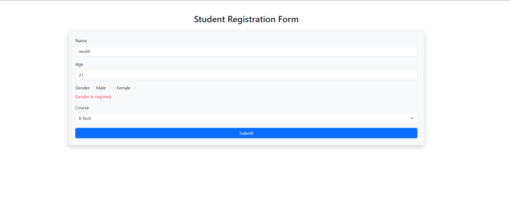

# 📝 Student Registration Form - Angular + Bootstrap

A simple and responsive student registration form built using **Angular** and **Bootstrap 5**.

This project demonstrates the use of:

- ✅ Angular with standalone component architecture
- ✅ Bootstrap styling for clean UI
- ✅ Template-driven forms with validation
- ✅ Angular directives like `*ngIf`, `*ngFor`, and `ngModel`
- ✅ Displaying submitted form data dynamically

---

## 🚀 Features

- 👤 Register a student with:
  - Name
  - Age
  - Gender
  - Course (dropdown)
- ✅ Form validation with error messages using `*ngIf`
- 📋 Display submitted student data below the form using `*ngFor`
- 🎨 Styled using Bootstrap 5 for a clean and responsive layout

---

## 🖼️ Screenshots

### 📌 Registration Form UI

---

### 📌 Submitted Student Data

---

